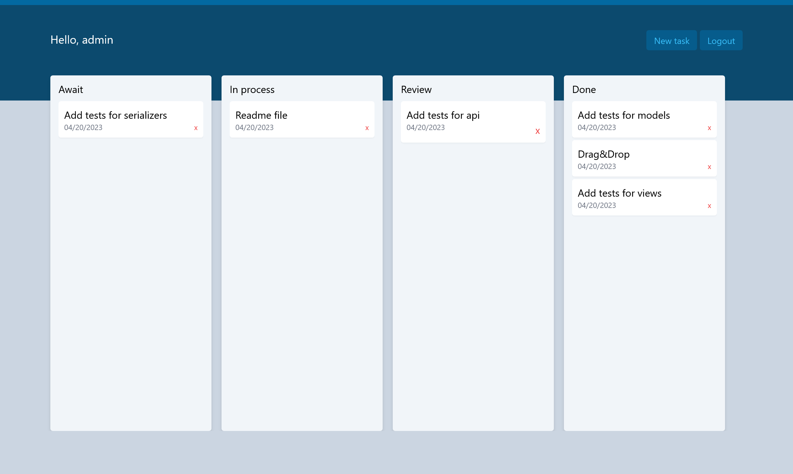

# Kanban-board (Django, DRF)

____

____

## Installation

```bash
git clone https://github.com/sivistrukov/kanban-board
python -m venv venv

# windows
source venv\Scripts\activate 
# unix
source venv/bin/activate
pip install -r requirements.txt

cd src/
python manage.py migrate
python manage.py createsuperuser
python manage.py runserver
```

____

## Footnote

Columns are configured through the admin panel.